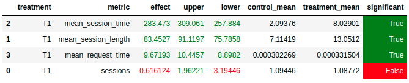

# RecSys homework
## Copyrights
Права на `botify`, `sim`, `script` и `original_README.md` принадлежат Николаю Анохину (nikolay.anokhin@gmail.com)

## Abstract
Идея в том чтобы вместо LightFM на бинарных данных использовать ALS на данных с implicit feedback'ом. В данном случае таким фидбеком для трека считается время прослушивания данного трека пользователем.

## Details
- Собрал 1 300 000 сессий с рандомным рекоммендером в качестве обучающего датасета
- Grid Search'ем подобрал гиперпараметры для ALS модельки
- Обучил на 85% данных (15% для валидации) с помощью PySpark ML
- Сгенерировал 30 рекомендаций для каждого пользователя
- Выгрузил полученные рекомендации в botify
- Рекомендую случайный из 30-ти треков
- Дополнительно слежу, чтобы в течении одной пользовательской сессии не было повторяющихся треков
- Если закончились треки для рекомендаций (отрекомендовали все 30 треков в одной сессии) - использую Sticky Artist рекоммендер

Процесс обучения вместе с подбором гиперпараметров занял примерно час-два.
Ноутбук для обучения ALS модели хранится по пути `notebooks/train_ALS.ipynb`.

## Results

Получившийся рекоммендер в сравнении со случайным рекоммендером:



## Instuction to reproduce

Дальнейшие инструкции будут предполагать, что следующие утверждения верны:
- директории `sim` и `script` добавлены в `PYTHONPATH`
- установлены пакеты из `sim/requirements.txt`
- используется `http://mipt-client.atp-fivt.org/` в качестве hdfs кластера
- обучающий датасет хранится в hdfs по пути `/user/mob2021032/joined_dataset`

1. Переходим в папку `botify` и выполняем команду `docker-compose up -d --build`
2. Дожидаемся пока botify запустится (проверяем готовность командой `docker logs recommender-container`)
3. Переходим в папку `sim`, выполняем команду для сбора данных для A/B теста: `python3 ./sim/run.py --episodes 2000 --recommender remote --seed 1337`
4. После сбора данных переходим в папку `script` и выгружаем данные на кластер следующей командой: `python3 dataclient.py --user mob2021032 --echo log2hdfs --cleanup ab_test_data`
5. Далее на кластере запускаем ноутбук следующими коммандами:
```sh
export PYSPARK_DRIVER_PYTHON=jupyter
export PYSPARK_PYTHON=/usr/bin/python3
export PYSPARK_DRIVER_PYTHON_OPTS='notebook --ip="*" --port=30042 --no-browser'
pyspark2 --master=yarn --num-executors=2
```
6. Ноутбуком `notebooks/analyze.ipynb` проверяем результаты A/B теста.
